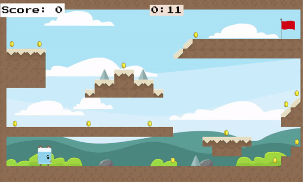

# BEAR - KOUR

---

A cute, lighthearted platform game originally inspired by the infamous Fireboy and Watergirl that's built using the javascript framework - phaser.js. Connected to a firebase database that displays a real-time leaderboard.
<br>
<p align="center">
  
</p>

## Table of Contents

---

- [Installation](#installation)
- [Usage](#usage)
- [Credits](#credits)

## Installation

To access this project without downloading lots of files / dependencies, head on over to this link: https://bear-kour.netlify.app/

#### Requirements

* [npm](https://nodejs.org/en/download/) 
* [git](https://git-scm.com/downloads)
* firebase

```
Use git to clone the directory.
Copy paste this command into the terminal: git clone https://github.com/tinamliang/Bear-Kour.git
```
```
Proceed to type in the command: npm-install in order for all the relevant dependencies to be install on your computer
Run npm run start, click the link and you can start playing the game!
```

## Usage

All the instructions are clearly listed out in the game but just a quick blurb of some unique features that were added to the game:

```
Your final score is stored in a firebase database and compared to all the scores achieved in the game. The top 5 scores will 
be displayed on the leaderboard.
```

## Credits

Huge credits go to **ourcade's** youtube channel. 

* Specifically their [pong tutorial](https://www.youtube.com/watch?v=yo40OaolRs8&list=PLumYWZ2t7CRvdJJ206QarbisxYPAyYwj0) that taught me how to create a phaser game with multiple scenes. 
